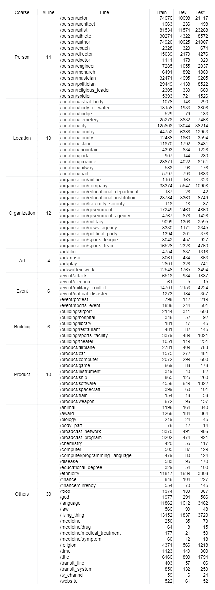

# MOVCNet

Codes and Datasets for our Findings of EMNLP 2023 paper: Incorporating Object-Level Visual Context for Multimodal Fine-Grained Entity Typing

## Data
- Download our dataset via this link
  
  (https://drive.google.com/drive/folders/1Kx_z1UIl4cEcMkpxdclgSdrwUYwZlAvo?usp=sharing)

- Download the object-level image feature via this link

  (https://pan.quark.cn/s/1e1f392a5102)

  It is a dict. The key is mention, the value is object feature extracted by VinVL.
  
- Follow [Lin and Ji(2019)](https://github.com/limteng-rpi/fet), we shuffle the training examples and split them into chunks.

## Requirement
- Python 3.8.8
- PyTorch 1.8.1+

## Run
Download all files and put them in `dataset/` , run the following command to train and eval the model:
    
    python train.py

## Dataset Information
The dataset distribution information.

